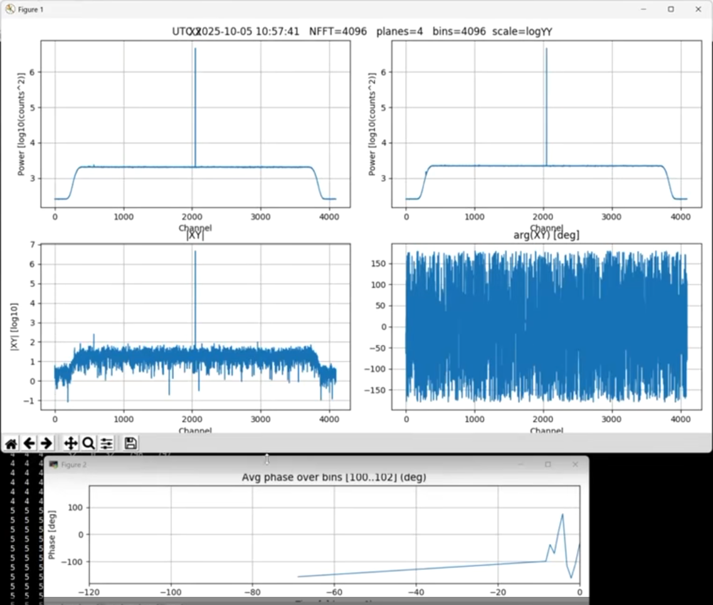
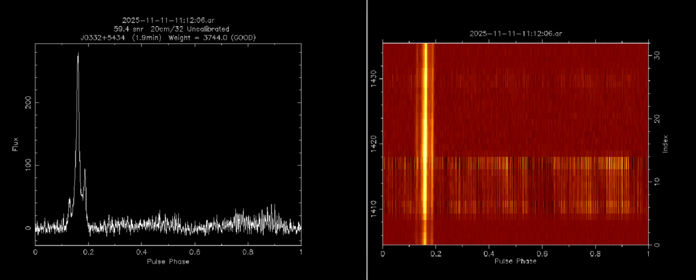
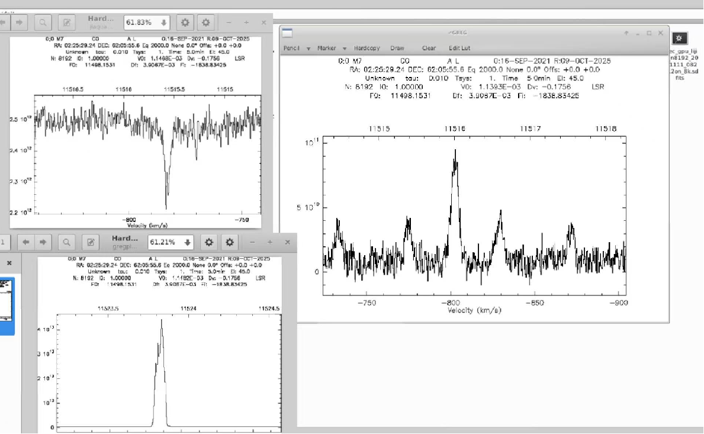
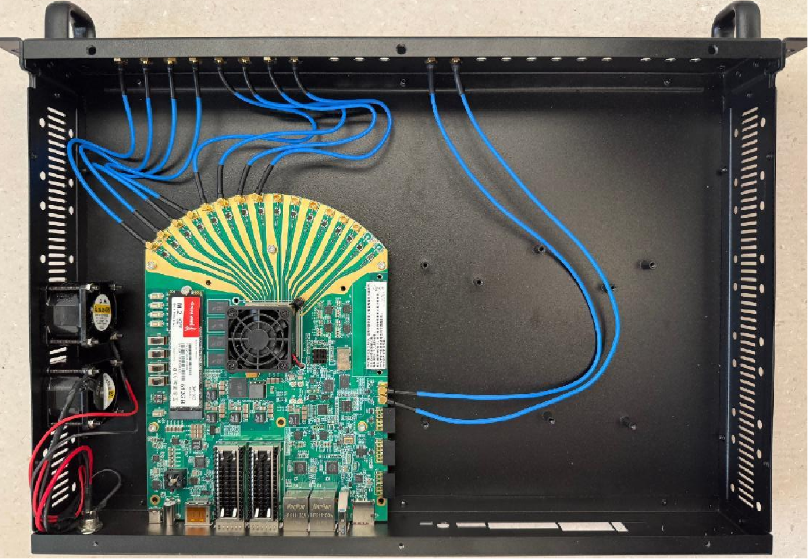

## dada缓冲区创建

bash dada.sh

## FPGA程序

运行于TQ47DR开发板，采样率4096M，采用RFDC内部混频nco（混频值可设置），输出32M 带宽2极化VDIF 格式基带数据。

### RFDC 的NCO设置
telnet 192.168.161.194 7147

set mixer cf = -100  (-2048--2048M)

?rfdc-update-nco 0 0 adc -100   
?rfdc-update-nco 0 1 adc -100   

get mixer

?rfdc-get-mixer-settings 0 0 adc

### UDP2DADA

udp2dada_vdif_blk2.c

#### 运行方式

./udp2dada_vdif_blk2 -k a000 --header header_all.cfg   --ip 10.17.16.1 --port 17200   --tsamp 3.125e-8 --freq 1420 --bw 32   --vdif-endian le --payload-endian le   --dfmax 31249 --batch 64

./dada_dbdisk -k a000 -D ./

接收rfsoc 发送过来的基带数据流写入dada缓冲区

### 实时监控

基带实时频谱监控

### 观测测试

脉冲星及谱线测试

### 开发板实物图

实物图
